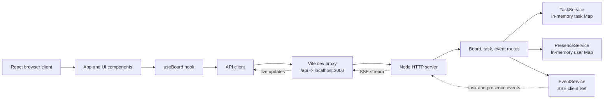

# Orbit Kanban

Orbit Kanban is a collaborative task board for creating, editing, deleting, filtering, and reordering work across a set of Kanban columns. It is a lightweight full-stack application built with React, Vite, and a Node.js HTTP API.

The application is intentionally small and dependency-light. Tasks and active users are kept in memory, and Server-Sent Events (SSE) provide live updates to connected browsers.

## Features

- Create, edit, and delete tasks.
- Drag tasks between columns and reorder them within a column.
- Filter by title, priority, and assignee.
- Keep filters in the browser URL so views can be shared or refreshed.
- Show live task changes from other connected clients.
- Track active collaborators through the presence API.
- Apply optimistic updates for editing, deleting, and moving tasks.
- Roll back failed optimistic mutations and display an error notification.

## UI Preview

### Light Mode


### Dark Mode


## Technology

### Frontend

- React 18 for the UI and component composition.
- Vite for development, proxying, and production builds.
- `@dnd-kit/core` and `@dnd-kit/sortable` for drag-and-drop interactions.
- `lucide-react` for interface icons.
- Tailwind CSS, PostCSS, and Autoprefixer for styling.
- Native `fetch` and `EventSource` for API and SSE communication.

### Backend

- Node.js built-in `http` server; no web framework is required.
- In-memory `Map` stores for tasks and connected/present users.
- Native Server-Sent Events for task and presence broadcasts.
- JSON request and response helpers in `backend/utils/http.js`.
- No database, authentication layer, or external service is required.

## Architecture



### Request and update flow

1. The browser loads the board with `GET /api/board`.
2. After the board loads, `useBoard` opens an `EventSource` connection to `GET /api/events`.
3. User actions update the local board immediately where optimistic behavior is enabled.
4. The API validates and mutates the in-memory store.
5. The backend broadcasts the resulting task event to every connected SSE client.
6. The originating client reconciles the server response and any deferred remote event.
7. Failed updates restore the affected tasks from the latest local snapshot.

In-flight task IDs are held aside while a local mutation is pending. This prevents a delayed SSE event from overwriting a newer local change. When SSE reconnects, the client refetches the board while preserving pending local cards.

## Project structure

```text
.
|-- backend/
|   |-- constants/
|   |   |-- board.js              Column, priority, type, and editable-field rules
|   |   `-- examples.js           Seed task data
|   |-- routes/
|   |   |-- boardRoutes.js        GET /api/board
|   |   |-- eventRoutes.js        Presence and SSE endpoints
|   |   `-- taskRoutes.js         Create, update, and delete task endpoints
|   |-- services/
|   |   |-- eventService.js       Connected SSE clients and broadcasts
|   |   |-- presenceService.js    Active user lifecycle and expiry
|   |   `-- taskService.js        Validation, ordering, and task storage
|   |-- utils/
|   |   `-- http.js               JSON parsing and response helpers
|   `-- server.js                 HTTP server and route registration
|-- frontend/
|   |-- src/
|   |   |-- api/client.js         API base URL and fetch wrapper
|   |   |-- components/           App, sidebar, columns, cards, and modal
|   |   |-- constants/board.js     Frontend column definitions
|   |   |-- hooks/useBoard.js      Board state, filters, mutations, and SSE
|   |   |-- utils/tasks.js         Sorting, event application, and rollback
|   |   |-- App.jsx                Page composition
|   |   |-- index.css              Global styles
|   |   `-- main.jsx               React entry point
|   |-- index.html
|   |-- package.json
|   |-- postcss.config.js
|   |-- tailwind.config.js
|   `-- vite.config.js             Dev server, port, and API proxy
|-- .env.example                   Shared local environment defaults
|-- package.json                   Backend and root development scripts
|-- README.md
`-- req.md                         Original project requirements
```

## Setup guide

### Requirements

- Node.js 20.6 or newer. The root start script uses Node's `--env-file` option.
- npm.

### Install

From the repository root:

```bash
npm install --prefix frontend
```

The root package has no runtime dependencies. Frontend dependencies are installed in `frontend/node_modules`.

### Configure

Create a root `.env` file from the example:

```bash
copy .env.example .env
```

PowerShell alternative:

```powershell
Copy-Item .env.example .env
```

Default values are:

```env
PORT=3000
FRONTEND_PORT=5173
VITE_API_URL=
```

`VITE_API_URL` is normally left empty. In development, Vite proxies `/api` to `http://localhost:3000`. Set it in `frontend/.env` only when the frontend must call an API at a different URL directly.

### Run the application

Open two terminals in the repository root.

Terminal 1, start the API:

```bash
npm start
```

Terminal 2, start the Vite frontend:

```bash
npm run dev
```

Open `http://localhost:5173` in a browser. The API should report `API listening on http://localhost:3000`.

To create a production frontend bundle:

```bash
npm --prefix frontend run build
```

### Troubleshooting

If Vite logs `http proxy error` or `ECONNREFUSED` for `/api/board`, `/api/presence`, or `/api/events`, the backend is not reachable at the configured API URL. Confirm that:

1. The backend is running in a separate terminal with `npm start`.
2. The backend reports `API listening on http://localhost:3000`.
3. `PORT` in the root `.env` matches the API port used by the frontend proxy.
4. `VITE_API_URL` is empty for the default local setup, or points to the same running API when customized.

Restart both processes after changing `.env` values. The frontend runs on `FRONTEND_PORT` (default `5173`) and the API runs on `PORT` (default `3000`); these are separate servers.

## API reference

| Method | Endpoint | Purpose |
| --- | --- | --- |
| `GET` | `/api/board` | Return all tasks sorted by column and position |
| `POST` | `/api/tasks` | Create a validated task |
| `PATCH` | `/api/tasks/:id` | Update task fields, status, or position |
| `DELETE` | `/api/tasks/:id` | Delete a task |
| `GET` | `/api/events` | Open an SSE stream for live events |
| `GET` | `/api/presence` | List active users |
| `POST` | `/api/presence` | Add or refresh a user presence record |
| `DELETE` | `/api/presence` | Remove a user presence record |

Task SSE event names are `task-created`, `task-updated`, and `task-deleted`. Presence changes are broadcast as `presence-updated`.

## Data and design decisions

- Task IDs are generated with `crypto.randomUUID()`.
- New tasks default to the `backlog` column and medium priority when values are omitted.
- Task titles are required and limited to 120 characters.
- Task positions are normalized when tasks move or are deleted.
- Presence records expire after 30 seconds without a refresh.
- The board is reset to the seed examples whenever the backend process restarts.
- Create waits for the server response; edit, delete, and drag operations use optimistic UI updates.

## Known limitations

- Data is not durable and there is no database.
- There is no authentication or authorization.
- There is no production static-file server in the backend.
- Remote moves update the changed task; sibling positions are not refetched independently.
- Drag-and-drop is pointer-based and does not currently provide keyboard dragging.
- The API is intended for local development and demonstration rather than production deployment.
